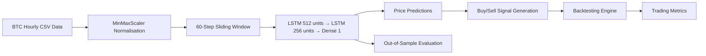

# Bitcoin Price Prediction using LSTM 📈

A deep learning project that uses **LSTM (Long Short-Term Memory)** networks to predict Bitcoin prices on hourly data and simulate a **long/short trading strategy** to evaluate real-world profitability.

## Features

- **LSTM Price Prediction**: Two-layer LSTM model trained on 35,000+ hourly BTC candles
- **Trading Strategy Simulation**: Long/short signal generation from predicted vs actual price comparison
- **Backtesting Engine**: Full P&L accounting with gross profit, drawdown, win rate, and trade metrics
- **Out-of-Sample Testing**: Model evaluated on a separate unseen dataset to test generalisation
- **Visualisation**: Predicted vs actual price plots for both in-sample and out-of-sample periods

## System Architecture



---

## Model Architecture

| Layer | Units | Activation | Notes |
|---|---|---|---|
| LSTM 1 | 512 | ReLU | `return_sequences=True` |
| LSTM 2 | 256 | ReLU | `return_sequences=False` |
| Dense | 1 | Linear | Price output |

- **Input**: 60-step lookback window of normalised close prices
- **Optimiser**: Adam
- **Loss**: Mean Squared Error
- **Trained on**: 80% of 35,664 hourly BTC candles
- **Epochs**: 10 | **Batch size**: 48

---

## Training Results

| Epoch | Loss | MAE |
|---|---|---|
| 1 | 3.43e-04 | 0.0059 |
| 5 | 2.87e-05 | 0.0032 |
| 10 | 2.02e-05 | 0.0027 |

---

## Trading Strategy & Backtest Results

Signals are generated by comparing predicted price to actual price:
- **Signal = +1** (Long): Predicted > Actual → price expected to rise
- **Signal = -1** (Short): Predicted < Actual → price expected to fall

Starting balance: **$10,000 USDT**

| Metric | Value |
|---|---|
| Gross Profit | $29,436 USDT |
| Gross Loss | $2,154 USDT |
| **Net Profit** | **$27,281 USDT** |
| Max Drawdown | 6.82% |
| Winning Trades | 1,762 |
| Losing Trades | 75 |
| Avg Winning Trade | $16,706 USDT |
| Avg Losing Trade | $287 USDT |
| Largest Winning Trade | $37,361 USDT |
| Largest Losing Trade | $682 USDT |
| Avg Holding Duration | 0.5 periods |
| Max Dip | 20.40% |
| Average Dip | 4.67% |

---

## Installation

### Prerequisites

- Python 3.7+
- Google Colab (recommended) or local GPU environment

### Setup

1. Install dependencies:

    ```bash
    pip install -r requirements.txt
    pip install pandas_ta
    ```

2. Mount Google Drive and place your data files:

    ```
    /content/drive/MyDrive/Colab Notebooks/new project/btc_1h.csv       ← training data
    /content/drive/MyDrive/Colab Notebooks/new project/outos.csv         ← out-of-sample data
    ```

    CSV format (no header):
    ```
    datetime, open, high, low, close, volume
    ```

---

## Usage

Open the Jupyter notebook in Google Colab or PyCharm and run all cells in order:

1. **Data loading & preprocessing** — reads CSV, normalises close prices, builds 60-step sliding windows
2. **Model training** — trains the two-layer LSTM for 10 epochs
3. **In-sample prediction & plotting** — plots predicted vs actual for the test split
4. **Backtesting** — runs the long/short strategy and prints all trading metrics
5. **Out-of-sample evaluation** — loads `outos.csv`, runs inference, and plots results

---

## Data

- **Training/Test data**: `btc_1h.csv` — 35,664 hourly BTC OHLCV candles
- **Out-of-sample data**: `outos.csv` — separate unseen BTC hourly data
- **Train/Test split**: 80% / 20%
- **Lookback window**: 60 hours

---

## Configuration

Key parameters to tune at the top of the notebook:

```python
LOOKBACK      = 60      # Sliding window size (hours)
TRAIN_SPLIT   = 0.8     # Fraction of data used for training
EPOCHS        = 10      # Training epochs
BATCH_SIZE    = 48      # Training batch size
LSTM_UNITS_1  = 512     # First LSTM layer size
LSTM_UNITS_2  = 256     # Second LSTM layer size
```

---
